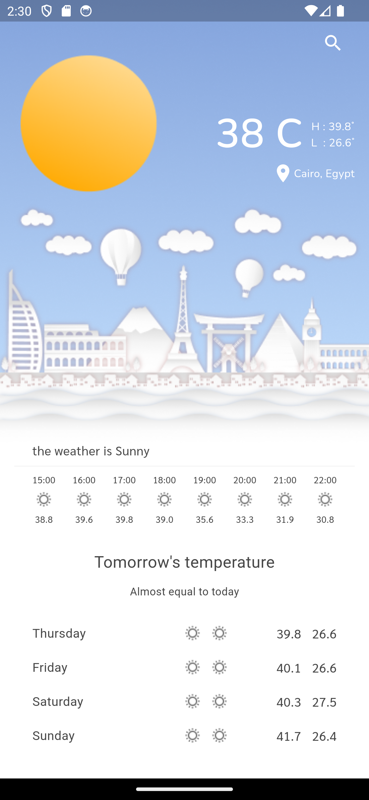
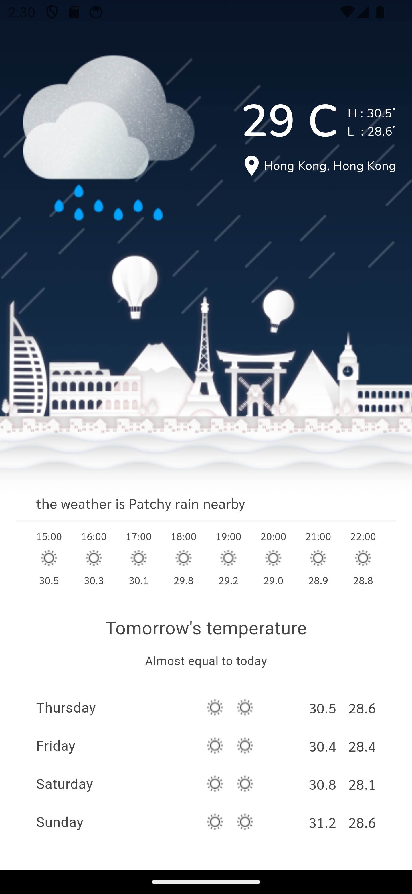

# Flutter Weather App


## Overview

The **Flutter Weather App** is a simple and elegant weather application that provides real-time weather updates for any location. The app is built using Flutter, and it fetches weather data from an external API. Users can search for any city and get information like temperature, humidity, wind speed, and more.

## Features

- **Real-Time Weather Updates**: Get the latest weather data for any city worldwide.
- **Search Functionality**: Search for any location and get detailed weather information.
- **Geolocation**: Automatically fetch weather data for your current location.
- **User-Friendly UI**: Clean and intuitive user interface designed with Flutter's Material Design.
- **Custom Animations**: Weather conditions are displayed with custom animations that match the weather type.

## Screenshots




## Installation

To run this project locally, follow these steps:

1. **Clone the repository**:
    ```bash
    git clone https://github.com/yourusername/weather_app_flutter.git
    cd weather_app_flutter
    ```

2. **Install dependencies**:
    ```bash
    flutter pub get
    ```

3. **Get your API key**:
    - Sign up for a weather API provider WeatherAPI.
    - Get your API key and then create file `lib/services/env.dart` then declare variable.
    ```bash
    String appKey = {your api key};
    ```

4. **Run the app**:
    ```bash
    flutter run
    ```

## API Integration

The app uses [weatherapi API](https://www.weatherapi.com/) (or your chosen API) to fetch weather data. Ensure you have an API key in file `env.dart` then set a String appKey = {your api key};.

## Folder Structure

```plaintext
flutter_weather_app/
├── android
├── assets
│   ├── images
│   └── fonts
├── ios
├── lib
│   ├── models
│   ├── data
│   ├── view
│   └── controller
├── test
└── pubspec.yaml
```